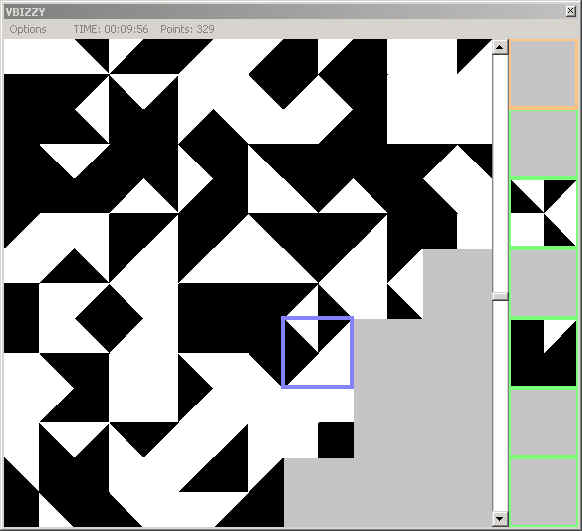



## VB  \-  IZZY

### Description

This game is played just like a jig-saw puzzle, but has an infinite number of solutions.

In order for a tile to fit on the board, all of the colors on the tile must line up with any adjacent tiles on the board.

After starting a game, select a tile from the 'tile-set' on the right hand of the form.

Place the tile on the board by left clicking.

Use the right mouse button to rotate the tile 90 degrees.

You can swap tiles by clicking on an existing tile on the board.

If you select a new tile from the tile-set before you place it on the board, then the previously selected tile will return to the tile-set.

You may also right-click on a board-tile to return it to the tile-set.

The game is over when you fill the board.

There is *always* a possible solution.

The exception being if you do not supply a big enough board for a given number of colors.

The score is based on the number of colors used and the size of the board.

Have fun!
 
### More Info
 

             |
---                |---
**Submitted On**   |2002-03-20 15:26:54
**By**             |[Dave Andrews](https://github.com/Planet-Source-Code/PSCIndex/blob/master/ByAuthor/dave-andrews.md)
**Level**          |Intermediate
**User Rating**    |4.7 (14 globes from 3 users)
**Compatibility**  |VB 5\.0, VB 6\.0
**Category**       |[Games](https://github.com/Planet-Source-Code/PSCIndex/blob/master/ByCategory/games__1-38.md)
**World**          |[Visual Basic](https://github.com/Planet-Source-Code/PSCIndex/blob/master/ByWorld/visual-basic.md)
**Archive File**   |[VB\_\_\-\_\_IZZ638493202002\.zip](https://github.com/Planet-Source-Code/dave-andrews-vb-izzy__1-32884/archive/master.zip)

